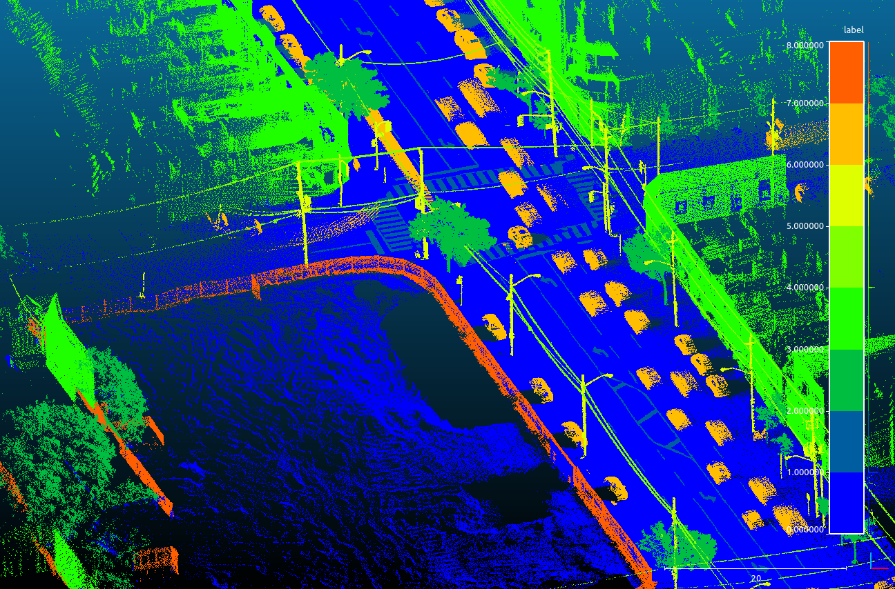
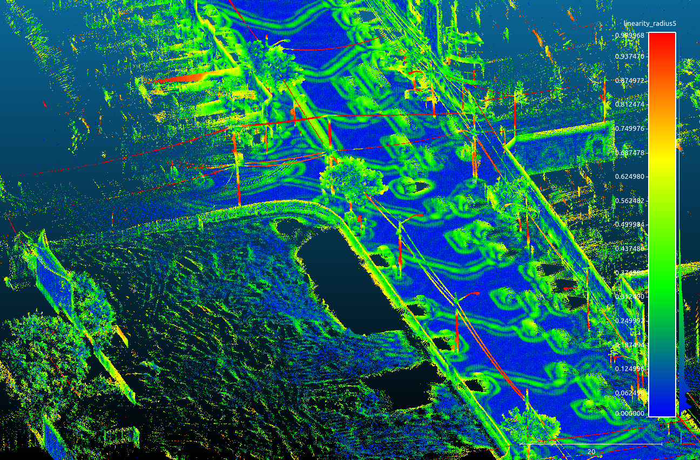
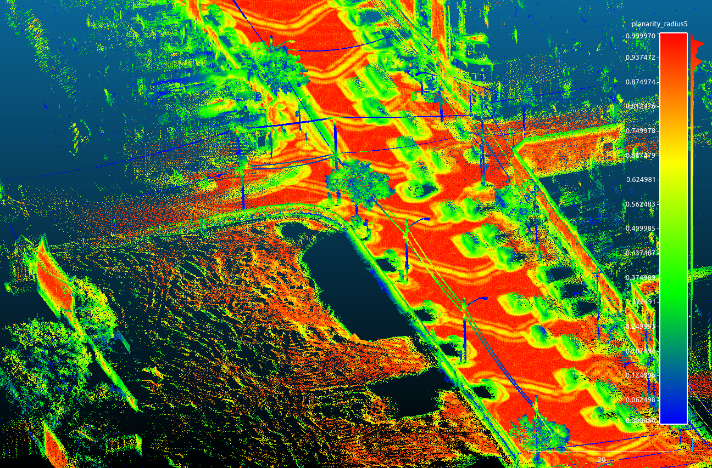
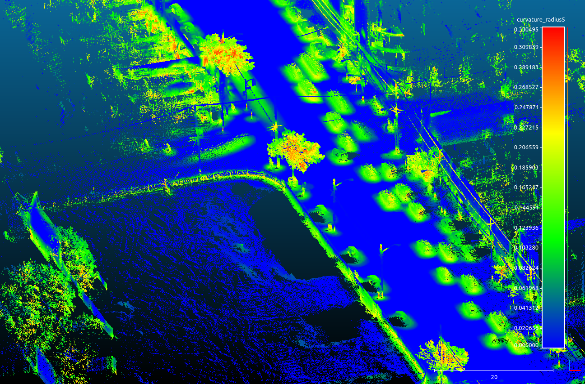

## Introduction 

This project will apply a random forest classifier and neural network to two different point clouds derived from LiDAR scans.  One of the scans is called **Toronto 3D** and consists of a mobile LiDAR scan of downtown Toronto [@tan_toronto-3d_2020].  The dataset is split into four sections with approximately 20 million points in the training data.  **L001** will be used for training and **L002** will be used for testing.  

The other dataset is of a high altitude aerial scan of Illinois from the **Illinois Geospatial Data Clearing House** [@noauthor_illinois_nodate].  The exact dataset is still to be decided but will be of one of the aerial scans with a fully classified point cloud. 

## Data cleaning and Feature extraction

The goal of the project is to test two feature extraction methods for point clouds that are then applied to a classifier.  A point cloud does not have any inherent features other than position in $\mathbb{R}^3$.  Let $C$ be a point cloud such that $C \subset \mathbb{R}^{3}$.  There are a few things worth noting about $C$:

* $C$ is a finite subset.

* Each point $p \in C$ has position $(x,y,z)$ that represents some object in an environment.

* $C$ should be independent of translation and rotation.  In other words, changing the raw coordinate data by applying rotations and translations does not fundamentally change the underlying objects that these points represent.

These three points present unique challenges to applying machine learning to point clouds that are not present in other data types.  Indeed, the points themselves are somewhat arbitrary since they can be transformed to another coordinate system.  This is common with this type geospatial data.  It is necessary to use neighboring points to find underlying geometric structure.  Hence, this project will use a common feature extraction method for point clouds by applying per point principal component analysis (PCA) with its neighbors.  The eigenvalues and eigenvectors derived from PCA give information on the underlying geometric structure of the point cloud.  

### Neighborhoods

It's important to understand what is meant by "neighborhood" when it comes to point clouds.  A neighborhood $N$ about a point $p$ is the set of points that satisfies some neighborhood criteria.  The most intuitive neighborhood is a point and radius.  A set of neighbors of point $p_o$ is defined as

\begin{equation} 
  N(p_{o}) = \{p \text{ s.t. } \|p_o - p\| \leq r \}
\end{equation} 

Other common defintions include *k nearest neighbors* and *cylindrical neighbors*.  This paper will compare the *radial* and *cylindrical* neighborhood methods by using a multiscaling approach similar to [@thomas_semantic_2018].  This paper used a radial multiscaling and downsampling method followed by a random forest classifier.  It however only used the radial method on mobile and indoor point clouds.  I will test the cylindrical and radial method on both mobile and aerial LiDAR scans.  

### Data cleaning

The point cloud is downsampled using a voxelization method.  Voxels are 3 dimensional cubes that are similar to 2 dimensional pixels in images.  The points are downsampled by taking the coordinate $(x,y,z)$ that is the centroid of a voxel $V$.  A downsampled point cloud is then defined as

\begin{equation} 
  C_v = \{ (x_v,y_v,z_v) \text{ s.t. } (x_v,y_v,z_v) \text{ is the centroid of a voxel } V \}
\end{equation} 

Then the neighbors used to compute the corresponding covariance matrix of $p \in C$ are 

\begin{equation} 
  N(p_{o}) = \{p \text{ s.t. } \|p_o - p_v\| \leq r \}
\end{equation}

where $p_v \in C_v$.  This method is used to ensure computational efficiency without losing the important geometric features.  This is done over a series of scales (i.e. voxel sizes) and radii.  As the radii increases, so does the voxel size.  A similar operation will be done with cylindrical neighbors.  

|   |   |
|:-:|:-:|
|  |   |
|  | |

The above image is a colorization of the point cloud.  The point cloud is colorized by label, linearity, planarity, and curvature (starting clockwise from the top left).  This is with a neighbor radius of 1.6 meters and a voxel size of 0.32 meters.  

The cacluated covariance matrix for a given point $p \in C$ is 

\begin{equation} 
  Cov(p) = \frac{1}{N} \sum((p_v - \bar{p}_v)^{T}(p_v - \bar{p}_v)
\end{equation}

where $p_v \in C_v$ and satisfies the neighborhood criteria about point $p$.  Since $Cov(p)$ is a symmetric matrix, it has 3 real-valued eigenvalues $\lambda_{1} \geq \lambda_{2} \geq \lambda_{3}$ with corresponding eigenvectors $(v_1, v_2, v_3)$.  These have geometric meaning as outlined by [@rusu_semantic_2010].

## Initial results

Initial tests on mobile data gave the following results

|              |   precision |   recall |   f1-score |
|:-------------|------------:|---------:|-----------:|
| ground       |        0.99 |     0.98 |       0.98 |
| building     |        0.99 |     0.83 |       0.91 |
| signage      |        0.49 |     0.67 |       0.57 |
| bollard      |        0.13 |     0.09 |       0.11 |
| trash can    |        0.43 |     0.5  |       0.46 |
| barrier      |        0.03 |     0.44 |       0.05 |
| pedestrian   |        0.2  |     0.11 |       0.14 |
| car          |        0.8  |     0.92 |       0.86 |
| vegetation   |        0.61 |     0.82 |       0.7  |
| accuracy     |        0.91 |     0.91 |       0.91 |
| macro avg    |        0.52 |     0.6  |       0.53 |
| weighted avg |        0.96 |     0.91 |       0.93 |

This was done over 6 radial neighborhoods, ranging from 0.1 meters to 3.2 meters.  Ground and building had high F1 scores while barrier, bollar, and pedestrian gave poor results.  It's important to note that ground, building, and car points are heavily unbalanced in the data.  Including more data from low scoring classes may improve the overall results.  This week I will complete the cylindrical neighborhood method on the mobile dataset and move on to the aerial data to compare methods.   

## Appendix
